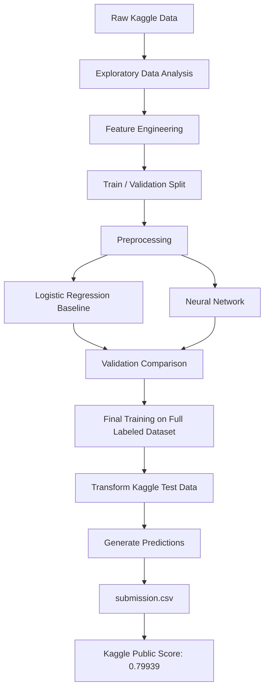

# Spaceship Titanic — End-to-End Machine Learning Project

[](https://www.python.org/)
[](https://www.tensorflow.org/)
[](https://scikit-learn.org/)
[](https://www.kaggle.com/competitions/spaceship-titanic)

An end-to-end binary-classification project for the [Kaggle Spaceship Titanic competition](https://www.kaggle.com/competitions/spaceship-titanic). The project covers exploratory data analysis, feature engineering, preprocessing, a Logistic Regression baseline, a TensorFlow/Keras neural network, final training, and Kaggle submission.

This version was intentionally built with concepts covered through **Course 2, Week 2 of Andrew Ng's Machine Learning Specialization**, prioritizing understanding of the complete ML workflow over using unfamiliar algorithms simply to increase leaderboard score.

## Results

| Model / Stage | Training Accuracy | Validation Accuracy | Kaggle Public Score |
|---|---:|---:|---:|
| Logistic Regression baseline | 0.7923 | 0.7872 | — |
| Neural Network | — | **0.8125** | — |
| Final Neural Network submission | — | — | **0.79939** |

The Logistic Regression model establishes a simple baseline. The neural network improves validation performance, and the selected architecture is retrained on all labeled training data before generating the final Kaggle predictions.

## Project Workflow



## Problem

The Spaceship Titanic dataset contains passenger information from a fictional interstellar voyage. The objective is to predict whether each passenger was transported to an alternate dimension.

This is a **binary classification** problem:

- `Transported = True`
- `Transported = False`

Kaggle evaluates submissions using **classification accuracy**.

## Dataset

The competition provides:

- `train.csv` — labeled training data
- `test.csv` — unlabeled passengers for Kaggle prediction
- `sample_submission.csv` — required submission format

The training dataset contains **8,693 passengers**. The Kaggle test dataset contains **4,277 passengers**.

Raw competition data is intentionally not committed to this repository. It should be downloaded directly from Kaggle.

## Exploratory Data Analysis

The EDA notebook investigates:

- dataset shape and data types
- missing values
- target distribution
- numerical feature distributions
- categorical feature distributions
- outliers
- relationships between features and `Transported`
- numerical correlations
- structure hidden inside `Cabin` and `PassengerId`

The analysis identified several useful feature-engineering opportunities instead of automatically discarding identifier-like columns.

## Feature Engineering

### Cabin decomposition

`Cabin` follows the structure:

```text
Deck / CabinNumber / CabinSide
```

It is decomposed into:

- `Deck`
- `CabinNumber`
- `CabinSide`

### Passenger group size

`PassengerId` contains a group identifier. The project extracts the group and creates:

- `GroupSize`

The raw `PassengerId` and intermediate `GroupId` are not supplied directly to the model.

### Total spending

The following spending features are combined into an additional summary feature:

- `RoomService`
- `FoodCourt`
- `ShoppingMall`
- `Spa`
- `VRDeck`

The resulting engineered feature is:

- `TotalSpending`

The original spending features are retained.

## Preprocessing

Preprocessing is implemented with Scikit-learn pipelines and `ColumnTransformer`.

### Numerical features

```text
Missing values → Median imputation → StandardScaler
```

### Categorical features

```text
Missing values → Most-frequent imputation → OneHotEncoder
```

`OneHotEncoder(handle_unknown="ignore")` prevents inference from failing if a previously unseen category appears later.

During development, the labeled dataset is split into training and validation sets using an **80/20 stratified split** with `random_state=42`.

## Models

### 1. Logistic Regression baseline

A Scikit-learn Logistic Regression model establishes the baseline.

```text
Training Accuracy   : 0.7923
Validation Accuracy : 0.7872
```

The small train-validation gap indicates similar performance on both subsets and provides a useful reference for evaluating the neural network.

### 2. Neural Network

The TensorFlow/Keras model uses:

```text
29 processed input features
        ↓
Dense(16, ReLU)
        ↓
Dense(8, ReLU)
        ↓
Dense(1, Sigmoid)
        ↓
P(Transported = True)
```

Configuration:

- hidden layer 1: 16 neurons, ReLU
- hidden layer 2: 8 neurons, ReLU
- output layer: 1 neuron, Sigmoid
- trainable parameters: 625
- loss: Binary Crossentropy
- optimizer: Adam
- metric: Accuracy
- validation accuracy: **0.8125**

After model development, a fresh final neural network is trained on the entire labeled training dataset before generating Kaggle predictions.

## Repository Structure

```text
spaceship-titanic-ml/
├── data/
│   ├── raw/                 # Kaggle CSV files — not tracked
│   └── processed/           # Generated arrays — not tracked
├── notebooks/
│   ├── 01_eda.ipynb
│   ├── 02_preprocessing.ipynb
│   ├── 03_baseline_models.ipynb
│   ├── 04_neural_network.ipynb
│   ├── 05_final_training.ipynb
│   └── 06_kaggle_submission.ipynb
├── models/                  # Saved model/preprocessor — not tracked
├── artifacts/               # Generated submission files — not tracked
├── src/                     # Reserved for reusable source code
├── requirements.txt
├── .gitignore
└── README.md
```

## Notebook Guide

| Notebook | Purpose |
|---|---|
| [`01_eda.ipynb`](notebooks/01_eda.ipynb) | Explore distributions, missing values, relationships, and feature structure |
| [`02_preprocessing.ipynb`](notebooks/02_preprocessing.ipynb) | Engineer features and build the preprocessing pipeline |
| [`03_baseline_models.ipynb`](notebooks/03_baseline_models.ipynb) | Train and evaluate the Logistic Regression baseline |
| [`04_neural_network.ipynb`](notebooks/04_neural_network.ipynb) | Build, train, visualize, and evaluate the neural network |
| [`05_final_training.ipynb`](notebooks/05_final_training.ipynb) | Rebuild preprocessing and train the final model on all labeled data |
| [`06_kaggle_submission.ipynb`](notebooks/06_kaggle_submission.ipynb) | Generate the final Kaggle submission |

## Installation

### 1. Clone the repository

```bash
git clone https://github.com/rifathasan404-blip/spaceship-titanic-ml.git
cd spaceship-titanic-ml
```

### 2. Create a Python 3.12 virtual environment

```bash
python3.12 -m venv .venv
source .venv/bin/activate
```

### 3. Install dependencies

```bash
python -m pip install --upgrade pip
python -m pip install -r requirements.txt
```

### 4. Register the Jupyter kernel (optional)

```bash
python -m ipykernel install --user \
    --name spaceship-titanic \
    --display-name "Python 3.12 (Spaceship Titanic)"
```

## Download the Dataset

Install the official Kaggle CLI if necessary:

```bash
python -m pip install kaggle
```

Configure Kaggle API credentials and join the competition. Then run:

```bash
kaggle competitions download -c spaceship-titanic -p data/raw
unzip data/raw/spaceship-titanic.zip -d data/raw
```

Expected files:

```text
data/raw/
├── train.csv
├── test.csv
└── sample_submission.csv
```

Never commit `kaggle.json` or other API credentials.

## Running the Project

Run the notebooks in order:

```text
01_eda.ipynb
    ↓
02_preprocessing.ipynb
    ↓
03_baseline_models.ipynb
    ↓
04_neural_network.ipynb
    ↓
05_final_training.ipynb
    ↓
06_kaggle_submission.ipynb
```

The final notebook produces:

```text
artifacts/submission.csv
```

## Kaggle Submission

Submit from the terminal:

```bash
kaggle competitions submit spaceship-titanic \
    -f artifacts/submission.csv \
    -m "Neural network submission"
```

Check the result:

```bash
kaggle competitions submissions spaceship-titanic
```

Current public score:

```text
0.79939
```

## What I Learned

This project was built as a learning-focused end-to-end ML workflow. Major lessons include:

- separating EDA from preprocessing and modeling
- preventing data leakage by fitting preprocessing only on training data during validation
- designing numerical and categorical preprocessing pipelines
- extracting useful information from structured string features
- establishing a simple baseline before using a more complex model
- connecting Logistic Regression mathematics with Scikit-learn
- connecting neuron/layer mathematics with TensorFlow/Keras
- reading training and validation accuracy/loss curves
- retraining the selected architecture on all labeled data for final inference
- preserving the fitted preprocessor for consistent test-data transformation
- generating and submitting predictions to a real Kaggle competition

## Current Scope and Future Improvements

This version intentionally stays within the algorithms and concepts learned when the project was built.

Possible future improvements after learning the underlying concepts:

- stronger feature engineering
- regularization experiments
- systematic model tuning
- additional classical ML algorithms
- reusable production-style code inside `src/`
- automated preprocessing and feature-engineering tests

The goal of this version is not to maximize leaderboard score at any cost. It is to demonstrate an understandable and reproducible machine-learning workflow from raw data to external evaluation.

## Acknowledgements

- [Kaggle — Spaceship Titanic](https://www.kaggle.com/competitions/spaceship-titanic)
- [DeepLearning.AI — Machine Learning Specialization](https://www.deeplearning.ai/courses/machine-learning-specialization/)
- TensorFlow/Keras and Scikit-learn documentation

---

**Author:** [Rifat Hasan](https://github.com/rifathasan404-blip)
